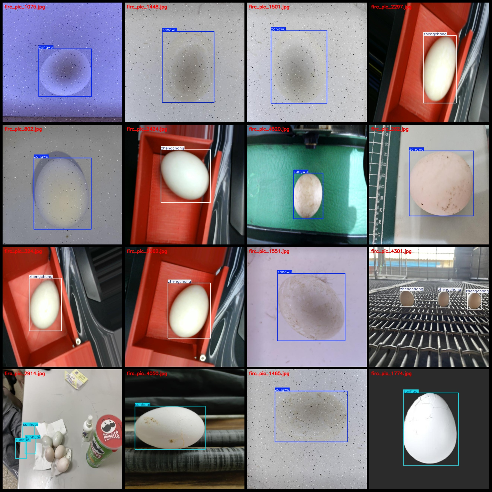

# Dataset: Duck Egg Quality Inspection Data

## Format: Pascal VOC + YOLO (without split path in .txt file, only containing jpg images along with corresponding VOC and YOLO format .txt files)

### Image Count (Number of jpg files): 4546
### Annotation Count (Number of .txt files): 4546
### Annotation Count (Number of .txt files): 4546
### Number of Annotation Categories: 4

Note: The order of categories in the .txt file does not correspond to the yolo format's category order; it is based on the labels folder's .txt file.

- Sunhuai
- Xueji
- Zangwu
- Zhengchang

Corresponding Chinese Category Names: ["Damaged", "Blood", "Dirty", "Normal"]

Each category has the following number of bounding boxes:
- Sunhuai: 2551
- Xueji: 334
- Zangwu: 2428
- Zhengchang: 3016

Total bounding box count: 8329

Each category occupies a number of images:
- Sunhuai: 1635
- Xueji: 245
- Zangwu: 1685
- Zhengchang: 1426

Image resolution: 640x640

Annotation tool used: labelImg

Annotation rules: Draw bounding boxes for each category.

Important Notice: The dataset does not have a training/validation/test split; you need to manually divide it.

Special Remark: This dataset does not guarantee any accuracy of the trained models or weights files.

[Example Annotation](path_to_your_annotation_example)

## Images

Here is a pay link on Stripe ( https://buy.stripe.com/3cs8yP7sY87d0vu9AB ). Please contact me lonlonago@foxmail.com after funding $89, and I will send you a complete data files , thank you!

